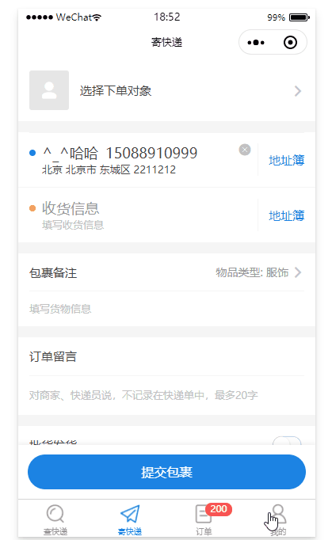

## 常见场景

### 分页加载
1. miniprogram-composition-api
```html
<template>
    <block a:for="{{list}}">
        {{item}}
    </block>
    <c-load-status loadStatus="{{ pageStatus }}"></c-load-status>
</template>
<script>
import {definePage, useRef} from 'miniprogram-composition-api'
import {usePagination} from '@wx/hooks'

definePage(() => {
    const list = useRef([])
    /** 用于分页加载的hooks */
    const {pageStatus, onRenderList} = usePagination()
    const renderList = onRenderList((page, handle) => {
        try {
            const {data} = await Api.Printer.getList({
                ...page
            })
            list.set(value => {
                if (page.page === 1) {
                    return data.list
                }
                return value.concat(data.list)
            })
            handle.success(data)
        } catch (e) {
            handle.fail(e)
        }
    })

    onPullDownRefresh(() => {
        renderList('reset', true)
    })
    onReachBottom(() => {
        renderList()
    })

    return {
        list,
        pageStatus
    }
})
</script>
```
2. mixins方案
```html
<template>
    <block a:for="{{list}}">
        {{item}}
    </block>
    <c-load-status loadStatus="{{ pageStatus }}"></c-load-status>
</template>
<script>

import mixinsSearchPanel from '../mixins/searchPanel';
import mixinsSearchPanelList from '../mixins/searchPanelList';

Page({
    mixins: [mixinsSearchPanel, mixinsSearchPanelList]
    data: {
        list: []
    },

    onLoad() {

    },

    async renderList() {
        const {data} = await this.searchList(Api.Printer.getList)
        if (data.page === 1) {
            return this.setData({
                list: data.list
            })
        }

        this.setData({
            data: this.data.list.concat(data.list)
        })
    },

    onReachBottom() {
        this.Reset();
    },

    onPullDownRefresh() {
        this.Refresh(true)
    }
})
</script>

```


### 分页加载:一个页面有两个列表,通过列表切换显示不同的列表
1. miniprogram-composition-api
```html
<template>
    <template name="list">
        <block a:for="{{list}}">
            {{item}}
        </block>
        <c-load-status loadStatus="{{ pageStatus }}"></c-load-status>
    </template>

    <block a:if="{{ tapType }}">
        <view>成功的列表</view>
        <!-- 可以采用的模板的方式,不用重复 -->
        <template is="list" data="{{ ...successList }}"></template>
    </block>
    <block a:else>
        <view>失败的列表</view>
        <!-- 可以采用的模板的方式,不用重复 -->
        <template is="list" data="{{ ...failList }}"></template>
    </block>

</template>
<script>
import {definePage, useRef} from 'miniprogram-composition-api'
import {usePagination} from '@wx/hooks'

definePage(() => {
    const tapType = useRef(true)
    const onChangeTap = () => {
        tapType.set(value => !value)
    }

    const successList = useList()
    const failList = useList()

    const getCurrent = () => {
        return tapType.value
            ? successList
            : failList
    }

    onPullDownRefresh(() => {
        getCurrent().renderList('reset', true)
    })
    onReachBottom(() => {
        getCurrent().renderList()
    })

    return {
        tapType,
        successList,
        failList
    }
})

function useList () {
    const list = useRef([])
    /** 用于分页加载的hooks */
    const {pageStatus, onRenderList} = usePagination()
    const renderList = onRenderList((page, handle) => {
        try {
            const {data} = await Api.Printer.getList({
                ...page
            })
            list.set(value => {
                if (page.page === 1) {
                    return data.list
                }
                return value.concat(data.list)
            })
            handle.success(data)
        } catch (e) {
            handle.fail(e)
        }
    })

    return {
        list,
        renderList,
        pageStatus
    }
}
</script>
```
2. mixins方案比较麻烦,要么拆组件维护各自的列表,要么公用一个列表,每次切换刷新


### 更新列表数据
以收件人为例, 进入收件人地址列表, 会有个`常用收件人列表`,以及下面分页加载的`正常的收件人列表`, 我还会再进入下一个页面,打开搜索页面,搜索到某个收件人后，对该`收件人地址`进行`更改收件人姓名`的操作, 
我们需要实现的是 同步更新 `搜索页面的收件人列表`,`常用收件人列表`,`正常的收件人列表` 中那个地址
可能还希望,我有选择收件人的功能,如果他也是被更新的地址,也一起更新,例如Q版选择收件人
除了常用,我还有最近添加的收件人地址



> 那么用 miniprogram-composition-api怎么写
1. 我们只需要一个维护特殊的数组对象即可

我们可以建立一个service
`consignee.service.js`
```js

/** 用这个取代message */
const event = useRef({type: '',query: {}})
function useConsigneeList (params: {
    watchCreate: boolean
}) {
    const list = useRef([])
    // 这段代码意思是监听event的变化, 相当于watch, 然后检测操作, 遍历list里面的内容,然后进行增删改查
    useEffect(() => {
        const {type, query} = event.value
        switch(type) {
            /** 更新收件人地址 */
            case 'update':
                list.set(value => {
                    return value.map(v => {
                        if (v.id === query.id) {
                            return query
                        }
                    })
                })
                break:
            case 'delete':
                // 同样对象这个list对象进行操作
                list.set(value => value.filter(() => {

                }))
                break
            case 'add':
                // 这样就可以选择性的我这个列表是否要添加打印机
                if (params.watchCreate) {

                }
                break;
        }
    }, [event])

    return list
}

export default {
    useConsigneeList,
    /** 更新收件人信息要求调用这个 */
    async update(data) {
        await Api.Printer.update(data)
        event.set({
            type:'update',
            query: data
        })
    },
    // 移除
    async delte() {
        await Api.Printer.delete(data)
        event.set({
            type:'add'
        })
    }
}
```

让我们看看页面

1. 编辑页面需要通过service更新地址
```js
import { update } from './consignee.service.js'

Component({
    methods: {
        async update() {
            const address = this.props.address
            await update(address)
        }
    }
})
```

2. 列表页面
```js
import { useConsigneeList } from './consignee.service.js'

definePage(() => {
    const list = useConsigneeList()
    const common_list = useConsigneeList()
    const add_list = useConsigneeList({watchCreate: true})

    onLoad(() => {
        common_list.set(Api.Printer.Common().data)
        list.set(Api.Printer.getList().data)
    })

    return {
        list,
        common_list,
        add_list
    }
})

```

现在列表名字你随便定了, 只需要使用useConsigneeList()返回给你的对象(容器就可以了),你往这容器里面塞值,更新的时候,会自动更新你容器里面的值,而且还会同步更新视图呢


>传统options api怎么实现
具体点说,就是列表页面和搜索页面都监听更新，删除，添加方法，然后循环自己页面的this.data[x]数据，进行更新,删除,每个页面都需要显式的引入监听，更新，删除的时候发出通知，带来的缺点就是，我每多一个列表, 就得再弄一个监听这个列表，没多一个页面，就得在这个页面上也对我某个list，进行增删改查


`收件人页面`
```js

import mixinsSearchPanel from '../mixins/searchPanel';
import mixinsSearchPanelList from '../mixins/searchPanelList';

// 更新收件人地址的混入
import mixinsUpdateConsignee from '.mixinsUpdateConsignee';

Componet({
    mixins: [mixinsSearchPanel, mixinsSearchPanelList, mixinsUpdateConsignee]
    data: {
        commonList: [],
        list: [],
        addList: []
    },
    onLoad () {
        /** 获取常用的收件人地址,并赋值到 commonList 上 */
        Api.Printer.Common().then(({data}) => {
            this.setData({
                commonList: data
            })
        })

        this.onReset()
    },

    methods: {
        /** 下面应该是分页加载列表,为了好理解，直接这样看 */
        renderList() {
            const {data} = await this.searchList(Api.Printer.getList)
            if (data.page === 1) {
                return this.setData({
                    list: data.list
                })
            }

            this.setData({
                list: this.data.list.concat(data.list)
            })
        }
    },

    onReachBottom() {
        this.Reset();
    },

    onPullDownRefresh() {
        this.Refresh(true)
    }
})
```

写完了基本的收件人列表，就需要实现更新列表item的混入了
下面这个js也是用于监听然后对固定的几个列表进行增删改查了
```js
import { Message } from '@clevok/message'
export default class Mixins extends wepy.mixins {
    onLoad () {
        /** 更新 */
        this.handle = Message.on('update:consignee', (detail) => {
            // 遍历页面上的list列表,commonList列表,找到对应的id,进行更新
            ['list','commonList', 'addList'].forEach(key => {
                this.data[key].forEach(item => {
                    if (item.id === detail.id) {
                        // 更新收件人地址
                        this.setData(/* **/)
                    }
                })
            })
        })
        /** 添加 */
        this.handle2 = Message.on('update:create', (detail) => {
            //往addList添加我刚加上去的
            ['addList'].forEach(key => {
                
            })
        })

        /* 还有删除呢**/
    }
    
    onUnload () {
        // 移除监听
        this.handle && this.handle()
    }
}

```
上面的混入将会被注入到搜索页面和列表页面,地址编辑后需要发出我的事件,才会更新列表中的数据

```js
编辑页面
Component({
    methods: {
        async update() {
            const address = this.props.address
            await Api.Printer.update(address)
            Message.emit('update:consignee',)
        }
    }
})

```
上面的能实现功能，但是带来以下几个问题
1. 你的页面将会有很多的事件监听这是其次, 当然其实还有一个选择功能,缓存当前选择的收件人，也需要同步更新删除，修改两个时间等等
2. 目前混入只会更新页面上的list,commonList,addList, 但是Q版创建包裹页面选择收件人地址页面,是叫 consigneeList 保存这个列表, 当然也可以加没问题，混入里面再加个事件，但是比较危险，因为你不一定看到这个混入内容，也限制了你的命名
3. 除了更新，还有新增，还有删除,事件多了起来，其实蛮难受的,毕竟都直接作用在你的页面上，如果其他地方也有更新收件人地址这个功能，我也是需要发出事件的，就上面代码看起似乎不是特别复杂
4. 还需要防止message命名冲突，还得注意移除事件监听
 

### 状态管理待更新